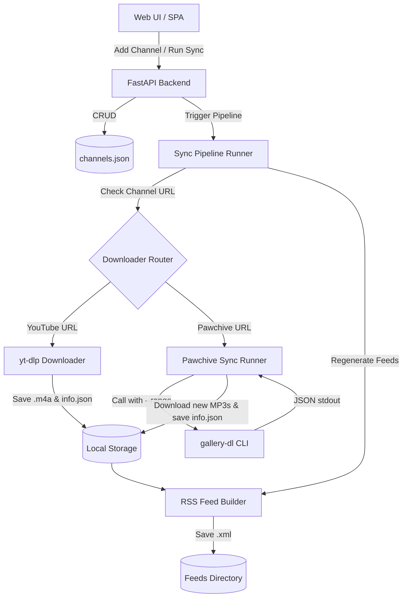

# Pawchive Integration Design Document (using gallery-dl)

This document outlines the design for extending PodQueue with Pawchive (`pawchive.pw` / `pawchive.st`) support using `gallery-dl` for metadata and attachment URL extraction. This combines community-maintained extraction logic with PodQueue's lightweight sequential download and serving pipeline.

---

## 1. Objectives

- Add native support for checking and downloading episodes from Pawchive creator pages using `gallery-dl`.
- Prevent site structure breakage by relying on `gallery-dl`'s extractors.
- Reuse existing feed-generation and state-cleanup pipelines with minimal overhead.
- Serve `.mp3` assets with HTTP Range Request compatibility out of the box.
- Support both YouTube and Pawchive feeds seamlessly within a single dark SPA Web UI.

---

## 2. Core Architecture



---

## 3. Detailed Component Modifications

### A. Downloader Module ([downloader.py](file:///c:/Users/victo/Documents/Misc/Oracle_cloud/PodQueue/podqueue_repo/podqueue/core/downloader.py))

1. **URL Validation & Helper:**
   - Implement `is_pawchive_url(url: str) -> bool` checking if `"pawchive."` is present in the lowercased URL.
2. **Download Routine Routing:**
   - Update `run_download_job()` to route channels matching `is_pawchive_url(channel.url)` to `run_pawchive_download(channel, force)`.
3. **Execution Logic (`run_pawchive_download`):**
   - Check sync interval and retrieve configuration (keeping the sequential flow lock).
   - Resolve the executable path of `gallery-dl` in the virtual environment.
   - Run the command to fetch only the newest posts:
     `.\venv\Scripts\gallery-dl.exe --dump-json --range "1-<limit>" "<channel.url>"`
     (incorporating proxy arguments if `settings.YTDLP_PROXY` is defined).
   - Parse the JSON list of outputs from stdout:
     - Group results by post `id`.
     - Extract `title`, `content` (description), `date` (published), creator `username` or `user_profile.name`, and the first attachment `.mp3` URL.
   - Filter out already downloaded posts using the updated `archive.txt` check (which supports both `youtube` and `pawchive` prefixed IDs).
   - For new posts (up to `channel.limit`):
     - Download the `.mp3` file directly via chunked streaming, saving to `data/downloads/{channel_id}/{post_id}.mp3`.
     - Clean HTML tags from the parsed description text using a simple regex/string helper.
     - Construct the avatar URL using `https://pawchive.st/icons/patreon/<user_id>`.
     - Write metadata to `{post_id}.info.json` using the standard schema:
       ```json
       {
         "id": "<post_id>",
         "title": "<post_title>",
         "upload_date": "YYYYMMDD",
         "description": "<clean_description>",
         "duration": 0,
         "channel": "<artist_name>",
         "thumbnails": [{"url": "<avatar_url>", "width": 400, "height": 400}]
       }
       ```
     - Append `pawchive <post_id>` to `archive.txt`.
4. **Cleanup Adaptation:**
   - Update `cleanup_old_episodes()` to glob for both `*.m4a` and `*.mp3` files, ensuring that total audio episodes are bounded by the configured channel limit.

### B. RSS Feed Builder ([rss.py](file:///c:/Users/victo/Documents/Misc/Oracle_cloud/PodQueue/podqueue_repo/podqueue/core/rss.py))

- Update the file scanner logic to list both `.m4a` and `.mp3` formats:
  `[f for f in os.listdir(podcast_dir) if (f.endswith('.m4a') or f.endswith('.mp3')) and not '.temp.' in f]`
- Set the `<enclosure>` tag `type` attribute dynamically based on file type:
  - If filename ends in `.mp3`: `type="audio/mpeg"`
  - Otherwise: `type="audio/mp4"`

### C. Channel Statistics & Dashboard UI

- Modify the database-to-file counts mapping to scan for both `.m4a` and `.mp3` extensions when updating the number of downloaded episodes on UI components in:
  - [channels.py](file:///c:/Users/victo/Documents/Misc/Oracle_cloud/PodQueue/podqueue_repo/podqueue/api/channels.py#L37)
  - [main.py](file:///c:/Users/victo/Documents/Misc/Oracle_cloud/PodQueue/podqueue_repo/podqueue/api/main.py#L71)
- Update [channels.js](file:///c:/Users/victo/Documents/Misc/Oracle_cloud/PodQueue/podqueue_repo/static/js/channels.js) to display a `🐾` or `📻` icon for Pawchive channels instead of `📺`.

### D. Update Command ([jobs.py](file:///c:/Users/victo/Documents/Misc/Oracle_cloud/PodQueue/podqueue_repo/podqueue/api/jobs.py) & [job_runner.py](file:///c:/Users/victo/Documents/Misc/Oracle_cloud/PodQueue/podqueue_repo/podqueue/core/job_runner.py))

- Update the pip update command to update both packages:
  `pip install -U yt-dlp yt-dlp-ejs gallery-dl`

---

## 4. Verification & Testing Plan

1. **Automated Integration Script:**
   - Write a developer test harness script that runs the `gallery-dl` wrapper against a Pawchive URL to verify successful JSON parsing, downloading, JSON logging, and archiving.
2. **RSS Generation Validation:**
   - Verify that XML output conforms to valid podcast parser requirements (checking MIME type, title, and file structures).
3. **Web UI Render Check:**
   - Launch application locally, load the Web UI, and verify form changes and feed card badges load correctly.
